# T2A2 - Marketplace Project

## **Cos-Meet - A two-sided marketplace for trading unwanted cosmetics and beauty products**

*Russell Moore*

## What problem are you solving, and why does it need solving? (R7 R8)

Quite often expensive cosmetics and beauty products go unused after a short novelty period, are purchased incorrectly, or received as unwanted gifts or samples; with perfume bottles worth hundreds of dollars sitting nearly full for years before being simply thrown out, with no centralized marketplace to trade these items to willing buyers. Many consumers build up large, expensive, and unused collections that do nothing but take up space in ever shrinking homes.

This service would allow owners (sellers) of high-end cosmetics that will ordinarily go to waste or remain unused to pass on these products to willing buyers. There are currently drips and drabs of these products on various sites, but a centralized platform would entice buys in a big way, especially as some items are ludicrously expensive and out of reach by those with more realistic budgets. This service will operating in the same vein as [LadyTradies](https://www.theladytradies.com.au/) providing cosmetics users a predominantly female marketplace and commuminty in which to operate, one that doesnt currently exist for sales of this type. 

## Deployed App URL (R9)

Unfortunatly I was receiving a plethora of errors trying to get Heroku up and running, and I have to submit this assignment without it being deployed. The windows installation is very complex and I have no idea how to proceed with no educators available.

## Github Repo URL (R10)

[Github Link](https://github.com/russ-13/CosMeet)

## App Description (R11)

***Purpose***

Cos-Meet will provide a place for buyers and sellers to trade unwanted high-end cosmetics and beauty gadgets -  at far less than RRP. The buyers would be able to purchase products much cheaper than usual, in a safe supportive environment among fellow consumers via postage with buyers retaining a rating/trust system.

***Functionality/Features***

# Login Feature

This feature will allow users to authenticate with the suite of Devise functionality, including password recovery tools. 

# Create listing Feature

This allows users to create new listings end edit them after creation, attaching an image and providing a price, description, and choosing from a category.

# View Store/Listings feature

This allows users to look at all the available listings once looked in. 

# Send Enquiry Feature

This feature was abandoned due to the limits of my abilities. 

***Sitemap***

.jpeg)

The original sitemap above was heavilly revised due to issues and the below map is more indicitive of the final product.

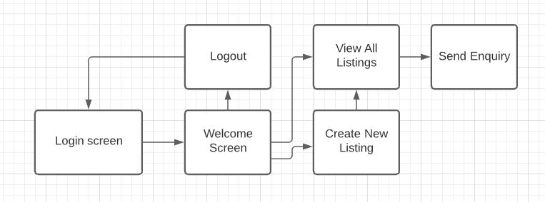

***Screenshots***

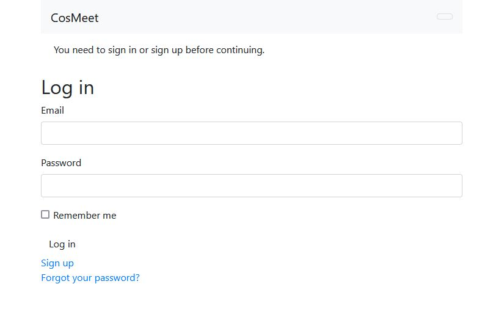

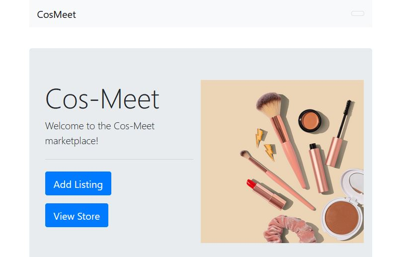

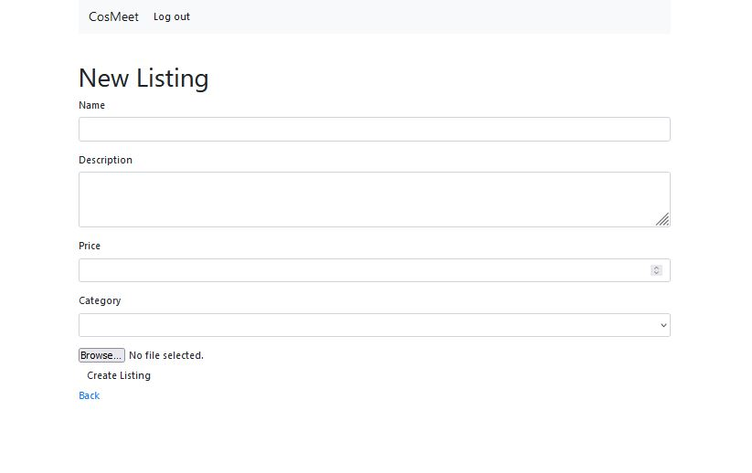

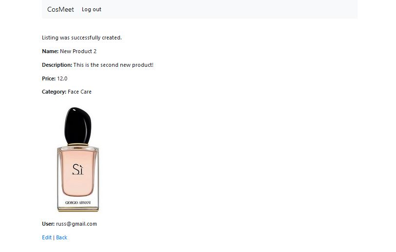

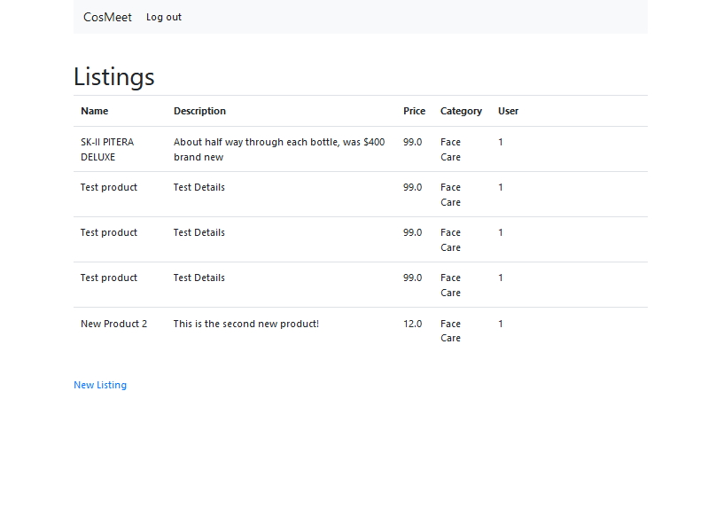

***Target Audience***

The target audience for Cos-Meet are individuals who purchase high-end cosmetic products that build up a collection over time, and are those looking to obtain these products without paying full price. The target sellers would be individuals with large collections wanting their goods to go to a good home and not be wasted – while collecting money to ‘upgrade’ their collections with more relevant items. These items can be unwanted samples or gifts, but mainly expensive products that are no longer used after the original customer wants to try a different product, this is very common with lots of people accumulating a treasure trove barely used items that are taking up valuable space in the home.

***Tech Stack***

    Ruby
    Ruby on Rails
    HTML
    CSS/SCSS
    Postgresql

## User Stories (R12)

I'm Sally, and as a consumer in the over-saturated market of high-end cosmetics, I want to be able to on-sell my expensive items that have only been used a handful of times that I no longer am interested in, so that I can make some of my money back to purchase new items that interest me. I'd like to show an image of the product I want to sell, and include a customer description as each item will be individual as they are second-hand. I often will buy a perfume for upwards of $200, that has a significant volume, and tire of it within a few weeks or months - when the product is still nearly full. I would like to pass on that product to somebody who wants to use it and who can't necessarily afford to purchase such products brand new. Occasionally I will buy a device that I intend to use a lot, such as a UV nail dryer, use it a few times and then decide it's no longer something I want to bother with, but still is in great condition and too expensive to simply discard - and I'd like to make of the purchase price back. 

I'm Jennifer, and as consumer of cosmetics on a budget, I would like to buy higher-end products on a second-hand market that I cannot necessarily afford brand new, so that I can have a higher quality of product for my money.  I like brand names but not the price tag associated with that, and I would like a place to purchase these products and gadgets from fellow consumers in a marketplace where I can see an image and description of the exact item I'm buying, and have it delivered to me after paying in a secure environment. I would also like to see a rating of the seller who I'm dealing with for added security. 

## Wireframes (R13)

I had some initial wireframes that looked like the ones below, but they were changed dramatically once the scope was revised mid-project. The set following were settled on after scope revision and the final product was modeled after these:

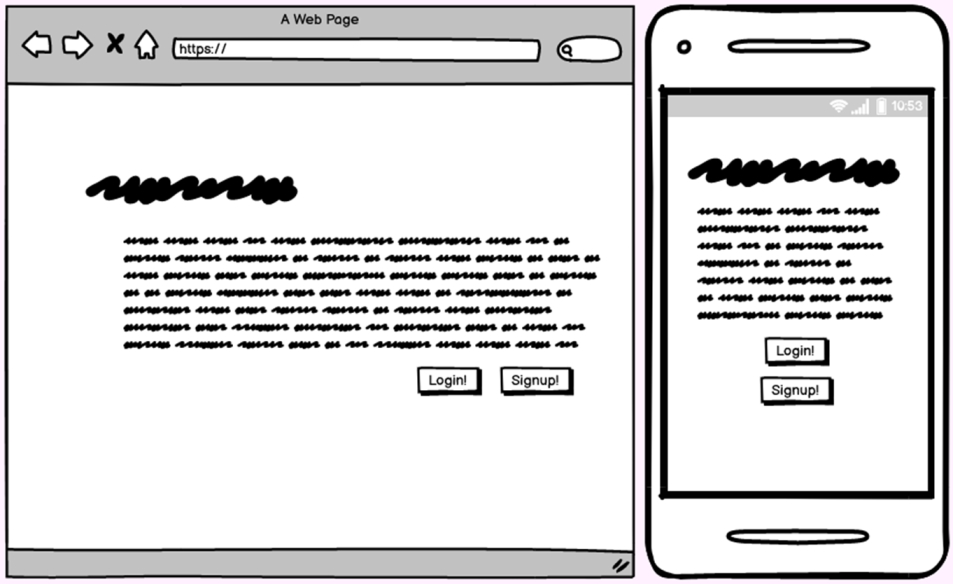

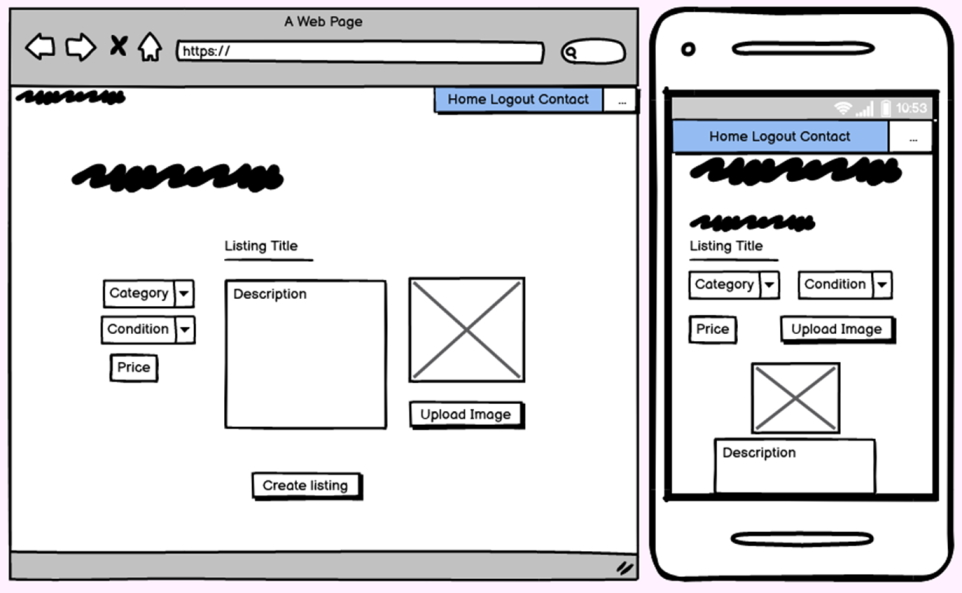

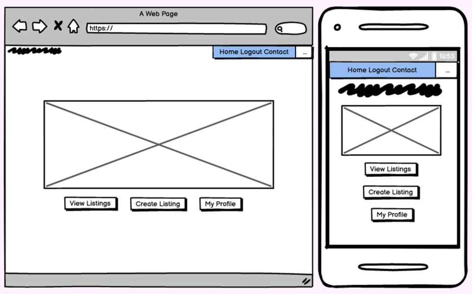

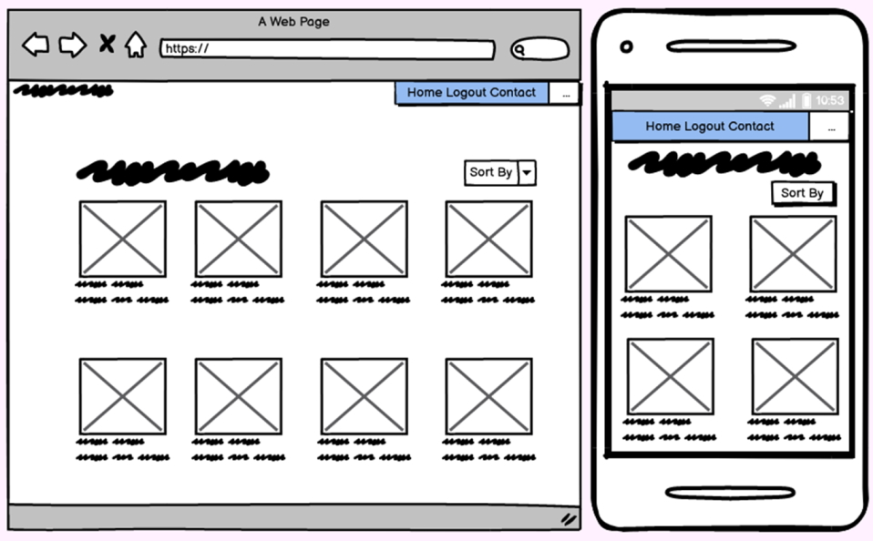

## The following wireframes were settled on after scope revision and the final product was modeled after these:

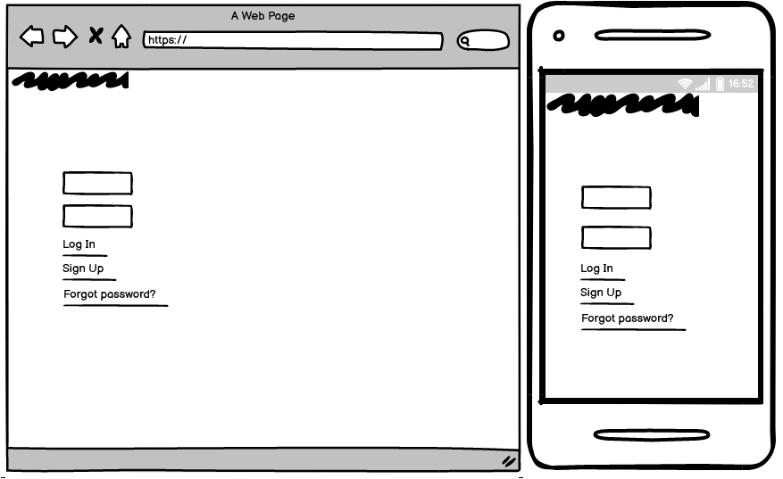

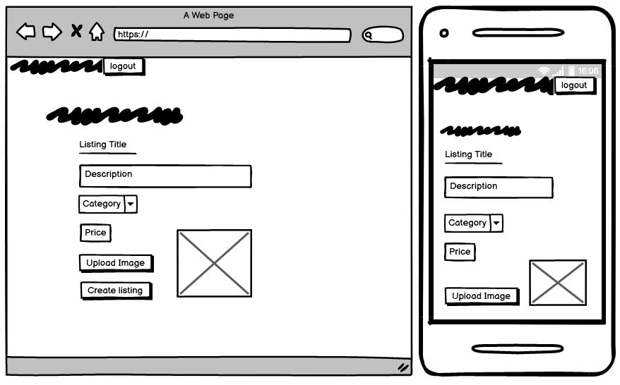

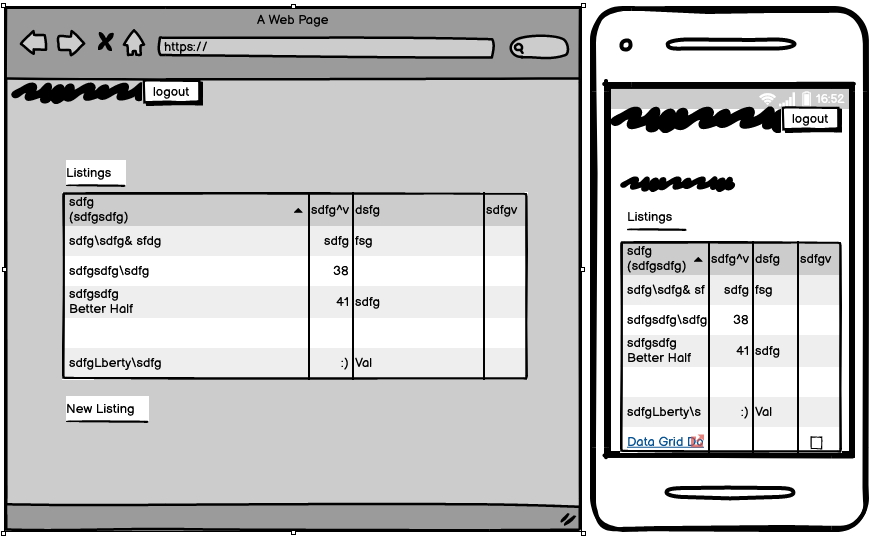

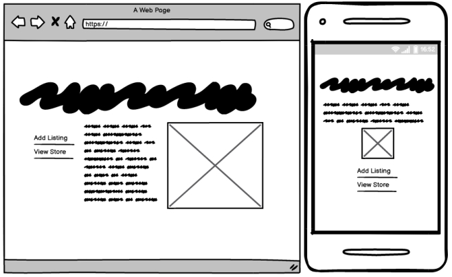

## ERD Details (14)

My original EDR diagram was as follows:

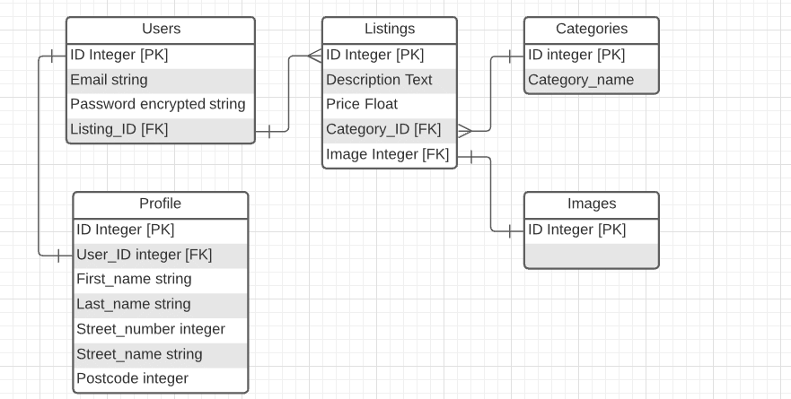

After the app was completed it looked like this:

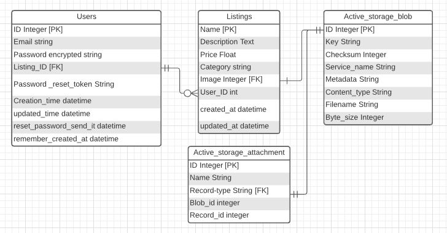

## Explanation of High-Level Components (R15)

This project features models, views and controller, as is the RoR convention. 

The models used were PotgreSQL databasing, and contained the databases for listings, users, and the active storgae information for uploaded images. 

The rails router contains a list of routes that exist within the application, and pushes them onto the next step, ie the controller. 

THe views contained in the project included some 'partials' which are featured on every page.

The controllers I used were one Application controller, a 'master' controller. 
-Listings controller, responsable for reading the data in models and providing it to the user in the form of a view.
-Home controller, which governed what was given to the view when on the home page.
-Store controller, which was responsable for reading the data in the store database and responding to requests by the user.

## Third Party Services Used (R16)
      
Balsamiq: Was used to create the wireframes during the planning phase of the app.
    
Trello: Trello is a project managment tool which i used to track and plan my progress and due dates.
   
Simpleform: This is a Ruby Gem for creating simple forms, their assosiations and functions.

Bootstrap 5: Bootstrap is another Ruby gem for assembling boilerplate style HTML and CSS styling.

Devise: Devise is a Ruby gem that takes care of authentication and authorisation. 

Heroku: Heroku is a platform to host websites, and has a free tier that I have utilized for this project.

## Project Models (R17)

Ruby On Rails uses models to "model" data, in the form of a database. These are created, read, undated and deleted by the controller. The models I used in the final version of this app are as follows:

Listings

This contained the listings and their data, when they are created by users.

Users

This is a record of the users who sign up to Cos-Meet.

## Database Relations (R18)

The relations of my database are:

Each Listing can have one and only one user
User can have many listings

Listings can have one image
One image can belong to one and only one listing

## Database schema design (R19)

The database schema image can be found below:

## Task Allocation (R20)

The project management tool I used for this assignment was Trello. I divided the whole task up into several categories and initiated a Trello board for the project, set up cards, and a to-do list within said cards. A rough due date was added to each card to keep the project on track. The Cos-Meet Trello board can be found here:

Below are the screenshots of the Trello board.